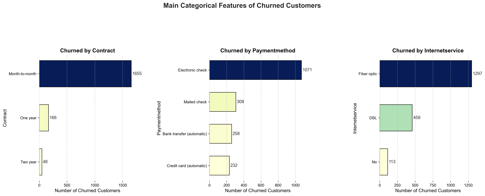

# **Data Cleaning and Processing Report**

## **Overview**

In this project, the dataset was cleaned and processed to make it ready for analysis. The data extraction was performed via a link, with the dataset in **JSON** format. The following steps were executed to ensure the data was in the correct structure for analysis:

1. **Data Import and Normalization**
2. **Data Cleaning**
3. **Data Transformation**
4. **Column Creation**

---

## **1. Data Import and Normalization**

The data was initially extracted from a **JSON** file using a link. To simplify the data, it was normalized to flatten nested columns and convert the structure into a format easier to analyze. The **data dictionary** is as follows:

### **Data Dictionary**:

| Column Name        | Description                                                                 |
| ------------------ | --------------------------------------------------------------------------- |
| `customerID`       | Unique customer ID                                                          |
| `Churn`            | Whether the customer left the company (Yes/No)                              |
| `gender`           | Gender of the customer (Male/Female)                                        |
| `SeniorCitizen`    | Whether the customer is 65 years or older (1 = Yes, 0 = No)                 |
| `Partner`          | Whether the customer has a partner (Yes/No)                                 |
| `Dependents`       | Whether the customer has dependents (Yes/No)                                |
| `tenure`           | Number of months the customer has been with the company                     |
| `PhoneService`     | Subscription to phone service (Yes/No)                                      |
| `MultipleLines`    | Subscription to multiple phone lines (Yes/No)                               |
| `InternetService`  | Subscription to internet service (DSL/Fiber optic/No)                       |
| `OnlineSecurity`   | Subscription to online security service (Yes/No/No internet service)        |
| `OnlineBackup`     | Subscription to online backup service (Yes/No/No internet service)          |
| `DeviceProtection` | Subscription to device protection service (Yes/No/No internet service)      |
| `TechSupport`      | Subscription to tech support service (Yes/No/No internet service)           |
| `StreamingTV`      | Subscription to cable TV service (Yes/No/No internet service)               |
| `StreamingMovies`  | Subscription to movie streaming service (Yes/No/No internet service)        |
| `Contract`         | Type of contract (Month-to-month, One year, Two year)                       |
| `PaperlessBilling` | Whether the customer prefers paperless billing (Yes/No)                     |
| `PaymentMethod`    | Payment method (Electronic check, Mailed check, Bank transfer, Credit card) |
| `Charges.Monthly`  | Total monthly charges for all services                                      |
| `Charges.Total`    | Total charges spent by the customer                                         |

### **Normalization**

The JSON structure was normalized using `pd.json_normalize` to flatten nested columns, and the cleaned data was stored in `../data/raw` as raw data for later processing. The following code was used to perform the normalization:

```python
# Normalization: flatten nested columns
df_custumers_norm = pd.concat([ 
    df_custumers.drop(['customer', 'phone', 'internet', 'account'], axis=1),
    pd.json_normalize(df_custumers['customer']),
    pd.json_normalize(df_custumers['phone']),
    pd.json_normalize(df_custumers['internet']),
    pd.json_normalize(df_custumers['account'])
], axis=1)
```

---

## **2. Data Cleaning**

After the normalization, a **general exploration** was performed using `.info()`, `.shape()`, `.columns()`, etc. The following steps were taken to clean the data:

### **Checking for Missing or Duplicated Data**:

A check for **missing values** and **duplicates** was performed. Fortunately, no missing values or duplicates were found, so no further data treatment was required.

### **Exploration of Categorical Columns**:

To ensure there were no inconsistencies in categorical columns (such as `gender`, `SeniorCitizen`, etc.), we checked for any unexpected values:

```python
# Check for consistency in categorical variables
expected_values = {
    'gender': ['Male', 'Female'],
    'SeniorCitizen': [0, 1], 
    'Partner': ['Yes', 'No'],
    'Dependents': ['Yes', 'No'],
    'PhoneService': ['Yes', 'No'],
    'MultipleLines': ['Yes', 'No', 'No phone service'],
    'InternetService': ['DSL', 'Fiber optic', 'No'],
    'OnlineSecurity': ['Yes', 'No', 'No internet service'],
    'OnlineBackup': ['Yes', 'No', 'No internet service'],
    'DeviceProtection': ['Yes', 'No', 'No internet service'],
    'TechSupport': ['Yes', 'No', 'No internet service'],
    'StreamingTV': ['Yes', 'No', 'No internet service'],
    'StreamingMovies': ['Yes', 'No', 'No internet service'],
    'Contract': ['Month-to-month', 'One year', 'Two year'],
    'PaperlessBilling': ['Yes', 'No'],
    'PaymentMethod': ['Electronic check', 'Mailed check', 'Bank transfer (automatic)', 'Credit card (automatic)'],
}
```

This ensured all categorical columns had valid and consistent values. If any invalid values were found, they were corrected by replacing them with the most frequent valid value.

### **Handling Missing Values**:

Any missing values were handled by filling numerical columns with the median value and categorical columns with the most frequent value (mode).

---

## **3. Data Transformation**

Data transformation included standardizing values to make the data more consistent and easy to work with for analysis and modeling. This involved converting text values like "Yes" and "No" into binary values (1 and 0), as this simplifies mathematical processing.

### **Binary Transformation**:

The following columns were transformed from categorical ("Yes"/"No") to binary (1/0):

```python
# Transform specified columns to binary values
columns_to_transform = [
    'Churn', 'Partner', 'Dependents', 'PhoneService', 'MultipleLines',
    'OnlineSecurity', 'OnlineBackup', 'DeviceProtection', 'TechSupport',
    'StreamingTV', 'StreamingMovies', 'PaperlessBilling'
]
```

### **Creating New Columns**:

A new column `DailyAccounts` was created by dividing `Charges.Monthly` by 30 to analyze daily billing information:

```python
# Create 'DailyAccounts' column
df_custumers_norm['DailyAccounts'] = df_custumers_norm['Charges.Monthly'] / 30
```

---

## **4. Data Types and Final Adjustments**

Finally, the correct data types were assigned to each column to ensure consistency and readiness for further analysis:

* `SeniorCitizen` and `Churn` were converted to categorical types.
* `Charges.Total` and `Charges.Monthly` were converted to float.

```python
# Convert 'SeniorCitizen' and 'Churn' to categorical
df_custumers_norm['SeniorCitizen'] = df_custumers_norm['SeniorCitizen'].astype('category')
df_custumers_norm['Churn'] = df_custumers_norm['Churn'].astype('category')
```

---

## **Processed Data Schema**

After cleaning and transforming the data, the final schema of the processed data is as follows:

| Column Name        | Data Type | Description                                                      |
| ------------------ | --------- | ---------------------------------------------------------------- |
| `customerID`       | object    | Unique customer ID                                               |
| `Churn`            | category  | Whether the customer churned (1 = Yes, 0 = No)                   |
| `gender`           | object    | Gender of the customer (Male/Female)                             |
| `SeniorCitizen`    | category  | Whether the customer is 65 or older (1 = Yes, 0 = No)            |
| `Partner`          | int64     | Whether the customer has a partner (1 = Yes, 0 = No)             |
| `Dependents`       | int64     | Whether the customer has dependents (1 = Yes, 0 = No)            |
| `tenure`           | int64     | Number of months the customer has been with the company          |
| `PhoneService`     | int64     | Subscription to phone service (1 = Yes, 0 = No)                  |
| `MultipleLines`    | object    | Subscription to multiple lines (Yes/No/No phone service)         |
| `InternetService`  | object    | Type of internet service (DSL/Fiber optic/No)                    |
| `OnlineSecurity`   | object    | Subscription to online security (Yes/No/No internet service)     |
| `OnlineBackup`     | object    | Subscription to online backup (Yes/No/No internet service)       |
| `DeviceProtection` | object    | Subscription to device protection (Yes/No/No internet service)   |
| `TechSupport`      | object    | Subscription to tech support (Yes/No/No internet service)        |
| `StreamingTV`      | object    | Subscription to streaming TV (Yes/No/No internet service)        |
| `StreamingMovies`  | object    | Subscription to streaming movies (Yes/No/No internet service)    |
| `Contract`         | object    | Type of contract (Month-to-month, One year, Two year)            |
| `PaperlessBilling` | int64     | Whether the customer prefers paperless billing (1 = Yes, 0 = No) |
| `PaymentMethod`    | object    | Payment method (Electronic check, Bank transfer, Credit card)    |
| `Charges.Monthly`  | float64   | Monthly charges for all services                                 |
| `Charges.Total`    | float64   | Total charges spent by the customer                              |
| `DailyAccounts`    | float64   | Daily billing amount                                             |

---

# Exploratory data Analysis (EDA)


## **1. Descriptive Statistics for Numeric Columns**

In this section, we provide basic statistics for the numeric columns in the dataset. These statistics help us understand the distribution of values, such as the mean, median, standard deviation, and percentiles. Here's a summary of the key metrics for each numeric variable:

### **Basic Statistics**

| Metric              | Churn | SeniorCitizen | Partner | Dependents | tenure | PhoneService | PaperlessBilling | Charges.Monthly | Charges.Total | DailyAccounts |
| ------------------- | ----- | ------------- | ------- | ---------- | ------ | ------------ | ---------------- | --------------- | ------------- | ------------- |
| **Count**           | 7043  | 7267          | 7267    | 7267       | 7267   | 7267         | 7267             | 7267            | 7267          | 7267          |
| **Mean**            | 0.265 | 0.163         | 0.484   | 0.300      | 32.35  | 0.903        | 0.593            | 64.72           | 2279.29       | 2.16          |
| **Std Dev**         | 0.442 | 0.369         | 0.500   | 0.458      | 24.57  | 0.296        | 0.491            | 30.13           | 2267.18       | 1.00          |
| **Min**             | 0.0   | 0.0           | 0.0     | 0.0        | 0.0    | 0.0          | 0.0              | 18.25           | 18.80         | 0.61          |
| **25th Percentile** | 0.0   | 0.0           | 0.0     | 0.0        | 9.0    | 1.0          | 0.0              | 35.43           | 401.40        | 1.18          |
| **Median**          | 0.0   | 0.0           | 0.0     | 0.0        | 29.0   | 1.0          | 1.0              | 70.30           | 1391.00       | 2.34          |
| **75th Percentile** | 1.0   | 0.0           | 1.0     | 1.0        | 55.0   | 1.0          | 1.0              | 89.88           | 3778.53       | 2.99          |
| **Max**             | 1.0   | 1.0           | 1.0     | 1.0        | 72.0   | 1.0          | 1.0              | 118.75          | 8684.80       | 3.96          |


### **Key Insights from the Descriptive Statistics:**

* **Churn Rate (0.265)**: Approximately **26%** of customers in the dataset have churned (left the service).
* **SeniorCitizen (0.163)**: Only **16%** of customers are senior citizens (aged 65+).
* **Partner (0.484)**: About **48%** of customers have a partner.
* **Dependents (0.300)**: **30%** of customers have dependents.
* **Tenure (32.35 months)**: The **average customer tenure** is around **32 months**, with a wide range (from 0 to 72 months).
* **Charges.Monthly (64.72)**: The **average monthly charge** for customers is about **\$64.72**, with values ranging from **\$18.25** to **\$118.75**.
* **Charges.Total (2279.29)**: **Total charges** vary significantly, with an average of **\$2279.29**, indicating some customers have much higher charges than others.
* **DailyAccounts (2.16)**: **Daily billing** averages **\$2.16**, with some customers paying more.

---

## **2. Descriptive Statistics for Categorical Columns**

In addition to the numeric data, we also examine the distribution of **categorical variables**. Below are the most frequent values for each categorical column:

### **Most Frequent Values **

| Column Name          | Most Frequent Value | Frequency |
| -------------------- | ------------------- | --------- |
| **MultipleLines**    | 0 (No)              | 3495      |
| **InternetService**  | Fiber optic         | 3198      |
| **OnlineSecurity**   | 0 (No)              | 3608      |
| **OnlineBackup**     | 0 (No)              | 3182      |
| **DeviceProtection** | 0 (No)              | 3195      |
| **TechSupport**      | 0 (No)              | 3582      |
| **StreamingTV**      | 0 (No)              | 2896      |
| **StreamingMovies**  | 0 (No)              | 2870      |
| **Contract**         | Month-to-month      | 4005      |
| **PaymentMethod**    | Electronic check    | 2445      |

### **Key Insights:**

* **Gender**: There are almost equal numbers of male and female customers.
* **MultipleLines**: Most customers do not have multiple phone lines.
* **InternetService**: The majority of customers have fiber optic internet, followed by DSL and no internet service.
* **Online Security, Backup, Device Protection, and Tech Support**: A large portion of customers do not have these services (marked as 0 or "No").
* **Contract**: Most customers are on a month-to-month contract.
* **PaymentMethod**: The most common payment method is electronic check, followed by mailed check and bank transfer.
* **Churn vs Contract Type**: The churn rate is notably higher among customers with a month-to-month contract, indicating that contract type might be a significant factor influencing customer churn.
* **Churn vs Internet Service**: Customers with **Fiber optic** internet service show a higher tendency to churn, which could suggest that this service type might have different customer retention dynamics.
* **Churn vs Payment Method**: **Electronic check** users have a higher churn rate, which could indicate dissatisfaction or other factors related to this payment method.

These findings give us a deeper understanding of how various factors, such as contract type, internet service, and payment method, relate to customer churn.

---

## ** Churn Proportion in Customers**

In this step, we aimed to understand how the "churn" (customer cancellation) variable is distributed among the customers. The following results are represented through two types of visualizations: a **pie chart** and a **bar chart**.

### **Pie Chart: Churn Proportion**

]

The pie chart shows the proportion of customers who have left the company (`Churn = 1`) compared to those who stayed (`Churn = 0`).

* **26.5%** of customers have **left** the service.
* **73.5%** of customers have **stayed** with the service.


---

### **Bar Chart: Customer Churn Distribution**

]

The bar chart shows the **absolute number of customers** who have stayed and those who left:

* The light blue bar represents the **number of customers who stayed**.
* The dark blue bar represents the **number of customers who left**.

This chart allows us to compare the **actual number** of customers who canceled their subscription against those who remained.


* The number of customers who stayed is much higher than the number of customers who churned. This gives us valuable insight into the overall customer retention levels, which could guide future retention initiatives.

The analysis of churn distribution is an essential part of understanding customer behavior. The **churn rate** (26.5%) indicates a considerable number of customers have left the service. This provides the foundation for further analysis, where we can explore additional factors that contribute to customer churn, such as contract type, monthly charges, and additional services. These insights will help in identifying the key drivers behind customer cancellation and improving retention strategies.


## **3. Churn Distribution by Categorical Features**
 The distribution of churn (customer cancellation) across various categorical features, such as Contract, Payment Method, and Internet Service. By analyzing this, we aim to uncover patterns that could help explain why certain customers are more likely to churn.



#### ** Churn Distribution by Contract**

| Contract Type  | Stayed (%) | Churned (%) |
| -------------- | ---------- | ----------- |
| Month-to-month | 57.29      | 42.71       |
| One year       | 88.73      | 11.27       |
| Two year       | 97.17      | 2.83        |


* **Month-to-month contracts** have the lowest **mean total charges** (\$1366.74), which may be linked to a higher churn rate for these customers.
* Customers with **one-year** and **two-year contracts** have **higher total charges** and longer tenures, indicating that customers who commit to longer contracts tend to stay longer and spend more.

#### ** Comparison of 'Charges.Total' and 'Tenure' Across Contract Types**

This analysis compares the **Total Charges** and **Tenure** across different contract types.

| Contract Type  | Charges.Total (Mean) | Tenure (Mean) |
| -------------- | -------------------- | ------------- |
| Month-to-month | \$1366.74            | 17.99 months  |
| One year       | \$3051.54            | 42.19 months  |
| Two year       | \$3703.10            | 56.74 months  |

This highlights the impact of categorical features on customer churn. By examining factors such as contract type and payment method we can identify patterns that may help to explain customer behavior. For example, month-to-month contracts and electronic check payments are associated with higher churn rates, suggesting that customers with these features may require additional attention to reduce churn.

#### ** Churn Distribution by Payment Method**

| Payment Method            | Stayed (%) | Churned (%) |
| ------------------------- | ---------- | ----------- |
| Electronic check          | 54.71      | 45.29       |
| Mailed check              | 80.89      | 19.11       |
| Bank transfer (automatic) | 83.29      | 16.71       |
| Credit card (automatic)   | 84.76      | 15.24       |


* **Electronic check users** have the highest churn rate (45.29%), indicating a potential area for investigation into payment preferences or issues.
* **Bank transfer** and **credit card payments** have lower churn rates, suggesting more stability among these payment method users.

#### ** Churn Distribution by Internet Service**

| Internet Service Type | Stayed (%) | Churned (%) |
| --------------------- | ---------- | ----------- |
| Fiber optic           | 58.11      | 41.89       |
| DSL                   | 81.04      | 18.96       |
| No internet service   | 92.60      | 7.40        |


* **Fiber optic** users show a high churn rate (41.89%), despite being one of the most popular internet service types. This could suggest service issues or competitive alternatives.
* **DSL** and **No internet service** customers exhibit lower churn rates, particularly the latter, possibly due to the lack of alternative options.


---

### ** 4. Churn Distribution Based on Other Features**

We also explored the churn distribution across other relevant features such as  **senior citizen status**, **partner status**, **dependents**, and more.


#### ** Churn Distribution by Senior Citizen Status**

| Senior Citizen | Stayed (%) | Churned (%) |
| -------------- | ---------- | ----------- |
| 0 (No)         | 76.39      | 23.61       |
| 1 (Yes)        | 58.32      | 41.68       |

* **Senior citizens** (age 65+) have a higher churn rate (41.68%) compared to non-senior customers (23.61%). This may reflect differing service needs or dissatisfaction.

#### ** Churn Distribution by Partner Status**

| Partner | Stayed (%) | Churned (%) |
| ------- | ---------- | ----------- |
| 0 (No)  | 67.04      | 32.96       |
| 1 (Yes) | 80.34      | 19.66       |


* **Customers without a partner** have a higher churn rate (32.96%) than those with a partner (19.66%). This suggests that personal circumstances, like having a partner, may influence retention.

* **Dependents**: Customers with dependents have a significantly lower churn rate (15.45%) compared to those without dependents (31.28%).
* **Phone Service**: There is a very small difference in churn rate between customers with and without phone service.
* **Multiple Lines**: Customers who have multiple lines or no phone service at all show higher churn compared to those with a single phone line.


## **Churn Distribution Based on Numerical Features**

### ** Analysis of Key Numerical Features Related to Churn**

In this step, we analyze the numerical features such as **Total Charges**, **Customer Tenure**, and **Daily Billing** to explore how these variables are distributed among **churned customers** (Churn = 1) and **non-churned customers** (Churn = 0). This analysis helps to identify whether certain numerical values are more strongly associated with churn, providing insights into the factors that influence customer behavior.

#### **Key Descriptive Statistics for Churned vs Non-Churned Customers**

##### **Churned Customers (Churn = 1)**

* **Total Charges**:

  * **Mean**: \$1531.80
  * **Median**: \$703.55
  * **Standard Deviation**: \$1890.82
  * **Range**: \$18.85 to \$8684.80
* **Tenure**:

  * **Mean**: 17.98 months
  * **Median**: 10 months
  * **Standard Deviation**: 19.53 months
  * **Range**: 1 to 72 months

##### **Non-Churned Customers (Churn = 0)**

* **Total Charges**:

  * **Mean**: \$2552.87
  * **Median**: \$1679.53
  * **Standard Deviation**: \$2327.60
  * **Range**: \$18.80 to \$8672.45
* **Tenure**:

  * **Mean**: 37.57 months
  * **Median**: 38 months
  * **Standard Deviation**: 24.11 months
  * **Range**: 0 to 72 months


* **Churned customers** have a significantly lower **mean total charges** (\$1531.80) compared to **non-churned customers** (\$2552.87), which could indicate that customers with lower lifetime spending are more likely to churn.
* **Churned customers** also have a **lower average tenure** (17.98 months) compared to **non-churned customers** (37.57 months), suggesting that customers with shorter relationships with the company are more likely to leave.

---

### ** Correlation Between Key Metrics and Churn**

#### ** Correlation Matrix**

The **correlation matrix** below shows the relationships between key metrics such as **Total Charges**, **Customer Tenure**, **Daily Billing**, and **Churn**:

|                        | Total Charges (\$) | Customer Tenure (months) | Daily Billing (\$) | Churn (0 = Stay, 1 = Leave) |
| ---------------------- | ------------------ | ------------------------ | ------------------ | --------------------------- |
| **Total Charges (\$)** | 1.00               | 0.82                     | 0.65               | -0.19                       |
| **Customer Tenure**    | 0.82               | 1.00                     | 0.25               | -0.34                       |
| **Daily Billing**      | 0.65               | 0.25                     | 1.00               | 0.19                        |
| **Churn**              | -0.19              | -0.34                    | 0.19               | 1.00                        |


* **Total Charges** and **Customer Tenure** are highly positively correlated (0.82), meaning that customers who have been with the company longer tend to spend more overall.
* **Churn** has a **negative correlation** with **Customer Tenure** (-0.34), indicating that customers who stay longer are less likely to churn.
* **Daily Billing** has a weak **positive correlation** with churn (0.19), suggesting that higher daily billing could be slightly associated with a higher likelihood of churn.

---


#### ** Correlation Heatmap**

]

The heatmap visualizes the **correlation matrix** of key metrics and churn. As shown:

* **Total Charges** and **Customer Tenure** have the strongest correlation with churn.
* **Daily Billing** has a moderate positive correlation with churn.

#### ** Key Feature Correlation with Churn**


The dotplot (Lollipop chart) shows how each key feature correlates with churn. Key findings:

* **Daily Billing** shows a small positive correlation with churn (0.19).
* **Customer Tenure** and **Total Charges** both have **negative correlations** with churn, which means that the longer the customer stays or the higher the charges, the lower the likelihood of churn.

---
 The key findings indicate that:

* **Shorter tenures** and **lower total charges** are associated with higher churn rates.
* **Customers with month-to-month contracts** and **electronic check payments** tend to have higher churn rates.


# **Conclusion**

The analysis of churn distribution and key metrics reveals several important insights:

* **Month-to-month contracts** and **electronic check payments** are strongly associated with higher churn rates.
* **Longer tenure** and **higher total charges** are associated with **lower churn rates**, highlighting the importance of customer loyalty.
* **Fiber optic** internet users have a higher tendency to churn, which could suggest service-related issues or competitive alternatives.

---

# **Recommendations to Reduce Customer Churn**

Based on the exploratory data analysis (EDA), several key factors contribute to customer churn. Below are the recommendations for improving customer retention:

## **1. Focus on Month-to-Month Contracts**

* **Recommendation**: Target customers with **month-to-month contracts** as they show the highest churn rate (42.71%).
* **Action**: Offer incentives for customers to switch to **longer-term contracts** (one-year or two-year contracts) to increase retention.

## **2. Address Payment Method Issues**

* **Recommendation**: **Electronic check users** have the highest churn rate (45.29%).
* **Action**: Investigate possible issues with **electronic check payments**, such as delays or dissatisfaction, and offer alternative payment methods like **credit card** or **bank transfer**.

## **3. Improve Fiber Optic Service**

* **Recommendation**: Customers with **fiber optic internet** have a high churn rate (41.89%).
* **Action**: Identify possible service issues and work on improving customer satisfaction with **fiber optic** internet services. Consider providing additional support for fiber optic users.

## **4. Retain Long-Term Customers**

* **Recommendation**: **Customers with longer tenure** have a lower churn rate.
* **Action**: Reward **loyal customers** with exclusive offers, discounts, or loyalty programs to keep them engaged and satisfied.

## **5. Enhance Customer Support and Service Add-Ons**

* **Recommendation**: Customers who do not subscribe to **add-on services** like **Tech Support**, **Device Protection**, and **Streaming Services** have a higher churn rate.
* **Action**: Promote additional services that enhance customer satisfaction and provide added value, such as **tech support**, **device protection**, or **streaming options**.

## **6. Reduce Billing Impact**

* **Recommendation**: Customers with **higher daily billing** are slightly more likely to churn.
* **Action**: Consider offering flexible billing options or discounts for customers who have a high daily charge, to alleviate financial concerns and increase retention.


